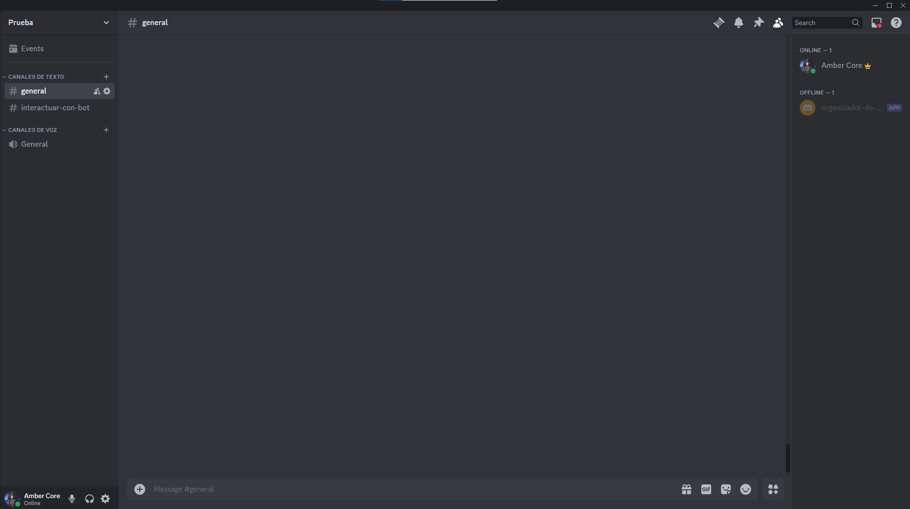
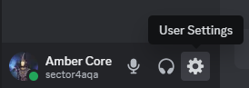
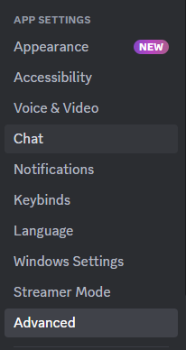
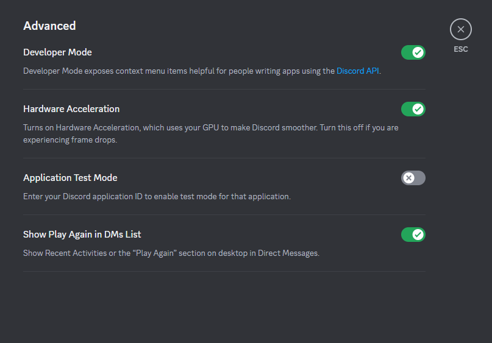
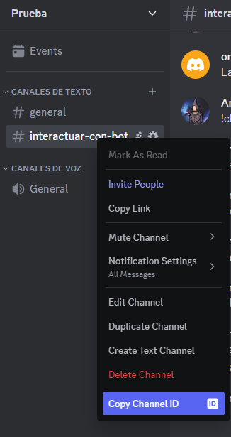
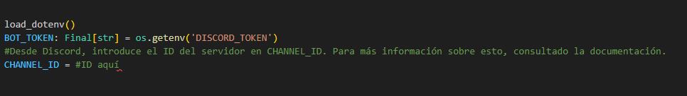
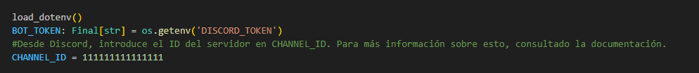

# Proyecto-Digi-2-trimestre
## Idea inicial
Para este proyecto he decidido desarrollar un programa/plugin para automatizar la subida de vídeos a Twitter, una especie de bot con el propósito de facilitar en específico el ámbito del marketing
de los videojuegos indie a través de la subido de contenido y clips diversos del juego, ya que esta suele ser una de las partes más tediosas del desarrollo de juegos.

En principio, los vídeos serán almacenados en una base de datos junto a mensajes opcionales que acompañarán al tweet como descripción de este. Esta podrá ser modificada en cualquier momento añadiendo nuevos clips o eliminando ciertos vídeos que quedaron obsoletos.

Cada viernes a las 21:00 (hora peninsular) escogerá un vídeo aleatorio para subirlo a Twitter junto a su texto correspondiente que se eliminará de la base de datos. De esta forma, el usuario solo tendrá que añadir el vídeo y el texto opcional acompañante a su respectiva base de datos en vez de tener que manualmente subirlo cada vídeo a Twitter.

## Idea final
Debido a las limitaciones de las versiones gratuitas del portal de desarrolladores de Twitter, la idea acabó sustituyéndose por un **bot organizador tareas de Discord**, donde se pueden almacenar tareas en una lista para marcarlas como pendientes y eliminarlas posteriormente y, a su vez, se puede comenzar un "tiempo de trabajo", donde habrá un seguimiento del tiempo trabajado y cada media hora el usuario recibirá una notificación para que tome un pequeño descanso.

## Uso del bot
Como el bot actualmente funciona en local, hay que seguir unos pasos antes de poder probar el bot.

Aunque no sea necesario, dentro de este entorno ya se instalaron discord.py y python-dotenv para el funcionamiento a través de:

    pip install discord.py
    
    pip install python-dotenv

Si por casualidad no aparece alguno instalado, vuélvelo a instalar con esos comandos.

Ahora sí, para utilizar del bot, es necesario seguir los siguientes pasos:

- **Paso 1:** Entrar a un servidor de Discord donde tengas permisos de administrador.
 

- **Paso 2:** Ir a ajustes de usuario.
 

- **Paso 3:** Bajar hasta App Settings y Advanced.
 

- **Paso 4:** Activar Developer Mode. Esto te permitirá utilizar el bot correctamente.
 

- **Paso 5:** Volviendo al servidor, entrar en un canal donde se desee usar el bot. Aquí se copiará su ID.

- **Paso 6:** Pegar tu ID en la variable CHANNEL_ID:

Es importante **no pegarlo entre comillas**, ya que debe de ser un entero para que el bot funcione correctamente:

## Respuestas a las preguntas
Ciclo de vida del dato (5b):

    ¿Cómo se gestionan los datos desde su generación hasta su eliminación en tu proyecto?

    Los datos se almacenan temporalmente en variables que más adelante se almacenan en un JSON para poder almacenar información a largo plazo.
    https://github.com/arodovi852/Proyecto-Digi-2-trimestre/blob/38aaf2c5a109bba0b410965f6456c40287413881/myenv/bot.py#L104-L115
    
    ¿Qué estrategia sigues para garantizar la consistencia e integridad de los datos?
    Todos los datos son almacenados en un JSON, ya que gracias a la naturaleza del JSON, la información se mantendrá guardada hasta que el usuario lo desee. Esto se realiza a través de funciones o comandos especiales donde el usuario introduce el nombre de una tarea que desee almacenar o, alternativamente, eliminar en caso de que exista.
    https://github.com/arodovi852/Proyecto-Digi-2-trimestre/blob/38aaf2c5a109bba0b410965f6456c40287413881/myenv/bot.py#L124-L140

    Si no trabajas con datos, ¿cómo podrías incluir una funcionalidad que los gestione de forma eficiente?

Almacenamiento en la nube (5f):

    Si tu software utiliza almacenamiento en la nube, ¿cómo garantizas la seguridad y disponibilidad de los datos?

    El proyecto no llegó a utilizar almacenamiento en la nube.

    ¿Qué alternativas consideraste para almacenar datos y por qué elegiste tu solución actual?

    La forma de almacenar datos del proyecto fue a través de un archivo JSON, donde se guardan las tareas que el usuario decide almacenar con el comando add(). Esto se debe a que el JSON ofrece una transferencia de datos rápida y, debido a que no es un bot que tenga en mente el manejo de grandes cantidades de datos, es la opción perfecta para almacenar información de manera ordenada sobre otras opciones como, por ejemplo, un archivo .txt.

    Si no usas la nube, ¿cómo podrías integrarla en futuras versiones?
    La manera más fácil de almacenar datos en la nube sería un servidor a través de AWS Lambda, que permite no solo subir el bot a internet para que otra gente pueda utilizarlo sino que también permite un mayor manejo de los datos. Sin embargo, esta opción es de pago, por lo que sería una implementación para un futuro.

Seguridad y regulación (5i):

    ¿Qué medidas de seguridad implementaste para proteger los datos o procesos en tu proyecto?

    Para proteger los datos más comprometidos como el token del bot, estos fueron almacenados en archivos separados, como en el caso del token, que fue guardado en un archivo dotenv, de forma que el token queda almacenado y no está directamente en el código.
    https://github.com/arodovi852/Proyecto-Digi-2-trimestre/blob/38aaf2c5a109bba0b410965f6456c40287413881/myenv/.env#L1
    
    ¿Qué normativas (e.g., GDPR) podrían afectar el uso de tu software y cómo las has tenido en cuenta?
    
    Como el bot no toma información personal más allá de leer los comandos que el usuario introduce, el bot cumple con absolutamente todas las normativas de los principios de protección de datos, como por ejemplo:
    - La minimización de datos personales, guardando solo las tareas que el usuario escriba en el JSON.
    - La transparencia, mostrándole al usuario la información que ha introducido y que puede eliminar si desea.
    - El límite de propósito, ya que la información solo es utilizada dentro del bot para guardar las tareas.
    - La precisión, que el propio usuario es capaz de controlar con los comandos.
    - El límite de espacio, que viene dato por las capacidades del JSON y puede ser controlado con los comandos endtask() y clear()

    Si no implementaste medidas de seguridad, ¿qué riesgos potenciales identificas y cómo los abordarías en el futuro?

Implicación de las THD en negocio y planta (2e):

    ¿Qué impacto tendría tu software en un entorno de negocio o en una planta industrial?

    En sitios donde la comunicación se lleve a cabo mediante servidores de discord puede ser bastante útil, ya que solo se necesita llamar a los comandos necesarios para poder trabajar con ellos. Además, como aplicación para administrar tareas de una forma más fácil puede ayudar, por ejemplo, durante reuniones de trabajo donde sea necesario llevar un seguimiento de las tareas necesarias.

    Sin embargo, al ser un proyecto de almacenamiento de datos a pequeña escala, esto tampoco podría utilizarse para tareas grandes, sino más bien tareas más específicas y puntuales como por ejemplo, las tareas a realizar durante un singular día de trabajo tras una reunión de trabajo por Discord.
    
    ¿Cómo crees que tu solución podría mejorar procesos operativos o la toma de decisiones?

    Facilitaría la administración de tareas en una aplicación que es ya de por sí bastante utilizada en ambientes laborales, permitiendo a los trabajadores organizarse más fácilmente.
    
    
    Si tu proyecto no aplica directamente a negocio o planta, ¿qué otros entornos podrían beneficiarse?

Mejoras en IT y OT (2f):

    ¿Cómo puede tu software facilitar la integración entre entornos IT y OT?
    
    El programa podría reemplazar el consumo de post-its tradicional en las empresas por el bot, ya que cumplen el mismo propósito pero el bot es mucho más rápido de manejar, más accesible directamente y no consume papel como lo hace el post-it. Además, su uso conllevaría un incremento en el uso de Discord, por lo que esto podría también considerarse parte de un proceso de digitalización, puesto que las reuniones de trabajo podrían llevarse a cabo por remoto desde la aplicación de Discord.

    ¿Qué procesos específicos podrían beneficiarse de tu solución en términos de automatización o eficiencia?

    Debido a su naturaleza general, cualquier trabajo podría beneficiarse del bot organizador de tareas, pero aquellos que trabajen por remoto y ya utilicen Discord de por sí serían los que más ganasen del bot, como todas las ramas de informática.

    Si no aplica a IT u OT, ¿cómo podrías adaptarlo para mejorar procesos tecnológicos concretos?

Tecnologías Habilitadoras Digitales (2g):

    ¿Qué tecnologías habilitadoras digitales (THD) has utilizado o podrías integrar en tu proyecto?
    
    La tecnología más fácil de integrar en el proyecto sería, en caso de necesitar almacenar más información en proyectos de mayor escala, un conjunto entre la nube y big data para el almacenamiento y procesamiento de grandes cantidades datos.

    Sin embargo, la IA sería otra opción bastante interesante, ya que esta podría atender a los usuarios para responder dudas puntuales o incluso dar formas de mejorar la organización de tareas, ya que proyecto se basa en esa idea.

    ¿Cómo mejoran estas tecnologías la funcionalidad o el alcance de tu software?
    
    A pesar de que ninguna fue implementada, la nube y big data podrían permitir que el bot se utilizado a una mayor escala, no teniendo que depender de las capacidades limitadas del JSON.

    Si no has utilizado THD, ¿cómo podrías implementarlas para enriquecer tu solución?
    
    La nube y big data podrían implementarse a través de servidores ya existentes online (a pesar de estar disponibles a partir de un cierto precio) y la IA sería especialmente interesante de implementar debido a las posibilidades que aporta a los comandos del propio bot.
